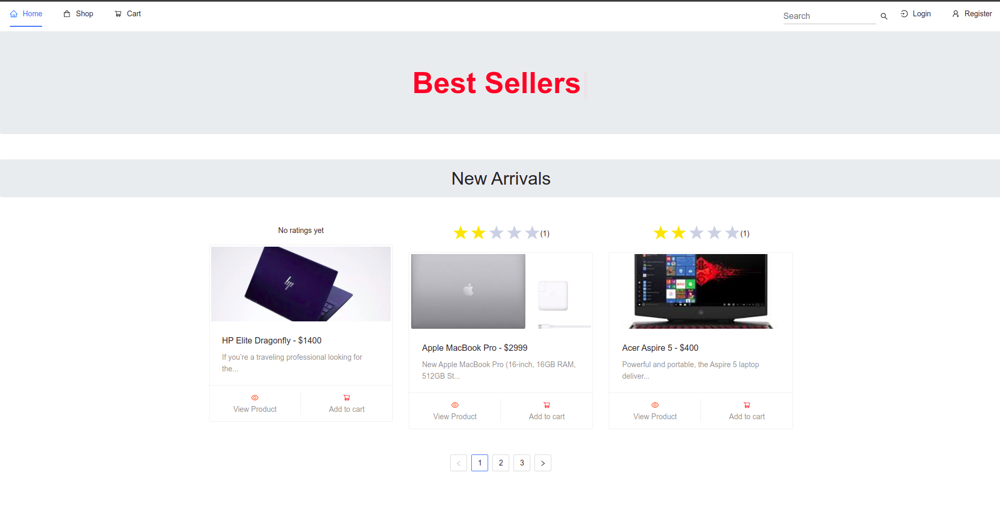

# Ecommy

A Fullstack Ecommerce project

**URL**: https://ecommy-frontend.herokuapp.com

## Tech Stack

- Backend: Express, NodeJS
- Frontend: ReactJS
- Database: MongoDB

## Features

- Login Registration System

- Login with Email/Password and social login (Google)

- Admin dashboard and order management system

- Products CRUD with advance features including categories, sub-categories, multiple image uploads etc

- Plenty of advance searching and filtering options

- Star rating system

- Cart functionality with both backend/frontend implementation

- Checkout with stripe for credit card payments

- Checkout with cash on delivery (no online payment required)

- User dashboard with password update, purchase history, Invoice/PDF download
